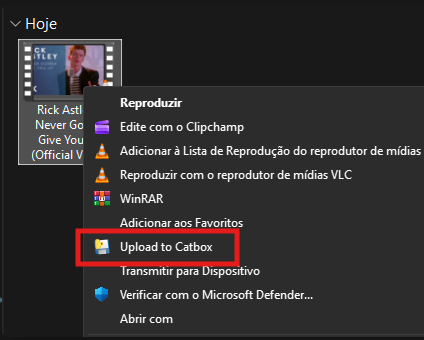
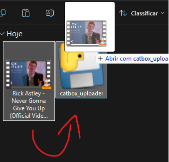

# Catbox Uploader

Upload files directly to [Catbox.moe](https://catbox.moe/) using the Windows right-click context menu or by dragging and dropping.

## Features

- **Direct Upload:** Sends your files directly to Catbox.moe. Just wait a few seconds and the direct link will automatically appear in your clipboard!
- **Super lightweight:** Runs silently in the background without opening any console windows.
- **File Limit:** Up to 200MB per file (Catbox.moe current limit).
- **Permanent Storage:** Files uploaded to Catbox are kept permanently (unlike Litterbox, which is temporary).
- **Bulk Uploads:** Select multiple files at once, and it will upload all of them, separating the links by line.
- **Supported OS:** Windows

## Screenshots

**CONTEXT MENU UPLOAD**


**DRAG AND DROP UPLOAD**


## Installation

1. Download the repository or the files.
2. Double-click the **`Install to Context Menu.bat`** file.
3. The button will be instantly available in Windows!

## Uninstallation

1. Double-click the **`Remove from Context Menu.bat`** file.
2. You can now safely delete the folder.

## For Developers (Compilation)

This project is a 100% native C# Windows application. It does not require Visual Studio to compile, as the C# compiler is built directly into Windows.

To compile it yourself, run the following command in PowerShell:
```ps1
C:\Windows\Microsoft.NET\Framework64\v4.0.30319\csc.exe /target:winexe /out:CatboxUploader.exe /reference:System.Windows.Forms.dll /reference:System.Net.Http.dll catbox_uploader.cs AssemblyInfo.cs
```

## ⚠️ Antivirus False Positives
Because this is a brand new, unsigned `.exe` that connects to the internet and modifies the clipboard, some strict antivirus engines on VirusTotal might flag it (usually 3-4 obscure vendors). **This is a known false positive.** 

The code is 100% open-source C#. You are encouraged to read `catbox_uploader.cs` to verify that the application only uploads your selected file to the official Catbox.moe API and absolutely nothing else. You can also compile it yourself using the instructions above!

## Disclaimer / Terms of Use

This tool is an unofficial client for Catbox.moe. By using this tool, you must agree to Catbox's [Acceptable Use Policy and Terms of Service](https://catbox.moe/legal.php). Do not upload illegal, copyrighted, or prohibited content. The creator of this tool is not responsible for the content uploaded by its users. All uploads are tied to the IP address of the machine running the application.
